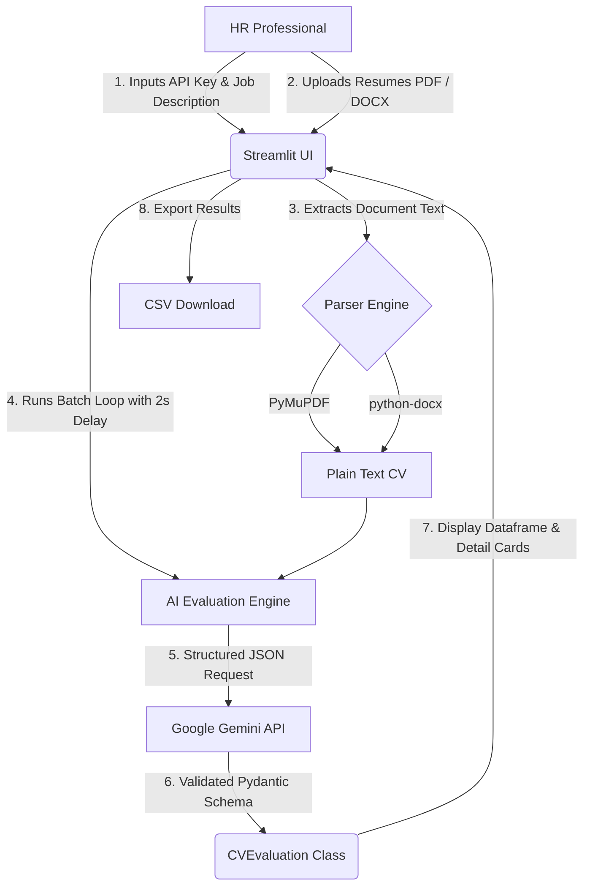

# 🎯 AI-Powered CV Analyzer Web App

[](https://cv-analyzer-2.streamlit.app/)

A high-performance, real-time HR recruitment dashboard built using **Streamlit**, powered by **Google Gemini (using the latest `google-genai` SDK)**, and validated with **Pydantic** to evaluate candidate CVs against Job Descriptions (JDs) in batches.

🚀 **Live Deployed Application**: [cv-analyzer-2.streamlit.app](https://cv-analyzer-2.streamlit.app/)

---

## ✨ Key Features

*   **⚡ Real-Time HR Dashboard**: Wide-screen layout with an interactive evaluation status bar and detailed result scoreboards.
*   **🤖 Smart Semantic Matching**: Powered by Gemini, the system uses advanced semantic understanding. It handles synonyms (e.g. recognizing "React.js" matches "React") and balances core vs. nice-to-have requirements fairly.
*   **🎛️ Dynamic Model Selector**: Allows you to switch between `gemini-2.5-flash`, `gemini-2.0-flash`, `gemini-1.5-pro`, or even type in a completely custom model identifier directly in the sidebar interface.
*   **📄 Multi-Format Document Parsing**: Built-in robust text extraction for both **PDF** (`PyMuPDF`) and **DOCX** (`python-docx`) files, handling column formats and complex spacing gracefully.
*   **🔍 Parser Verification View**: A nested `"📄 View Extracted CV Text"` expander inside each candidate's evaluation card, letting you see exactly what the text parsers sent to the AI engine.
*   **✅ Structured Pydantic Output**: Every evaluation strictly conforms to a robust schema (`match_score`, `key_expertise`, `missing_skills`, `hr_recommendation`, `justification`).
*   **🔒 Strict Privacy-First Design**: Parses files completely in-memory (RAM). No uploaded resumes, parsed texts, or API keys are ever saved to databases or cached on disk.
*   **⚙️ Rate-Limit Guards**: Designed with a built-in safety delay to prevent hitting API call thresholds on free-tier Gemini API keys.
*   **📊 Interactive Detail Cards & Export**: Collapsible detail logs per candidate with an interactive green-to-red scorecard gradient and one-click **CSV export**.

---

## 🛠️ Architecture Workflow



---

## 🚀 Getting Started Locally

### Prerequisites
Make sure you have **Python 3.9 - 3.12** installed on your system.

### 1. Clone & Navigate
```bash
git clone https://github.com/YOUR-USERNAME/CV-Analyzer-Streamlit.git
cd CV-Analyzer-Streamlit
```

### 2. Install Dependencies
```bash
pip install -r requirements.txt
```

### 3. Run the App
```bash
streamlit run app.py
```
This will spin up a local development server and automatically open the application in your default browser at `http://localhost:8501`.

---
## ⚙️ App Tech Stack

*   **Frontend & UI**: Streamlit
*   **LLM Integration**: Google GenAI SDK (`google-genai`)
*   **Parsing**: PyMuPDF (`fitz`), python-docx
*   **Data Validation**: Pydantic (`v2`)
*   **Data Processing**: Pandas

---

## 📄 License
This project is licensed under the MIT License.
